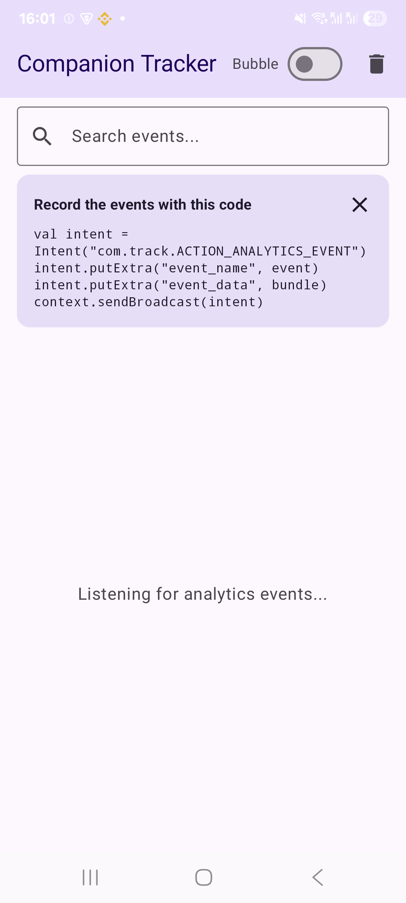
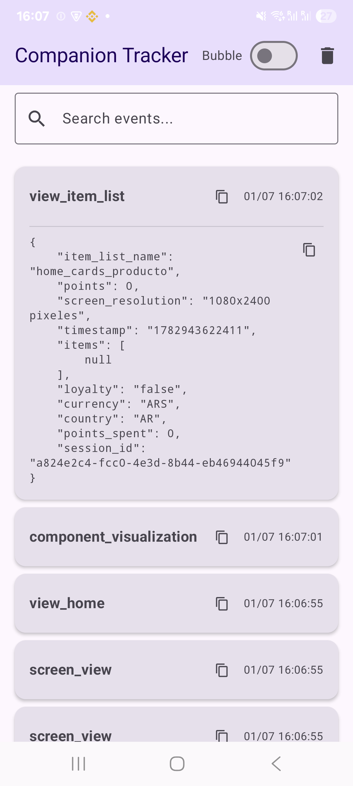
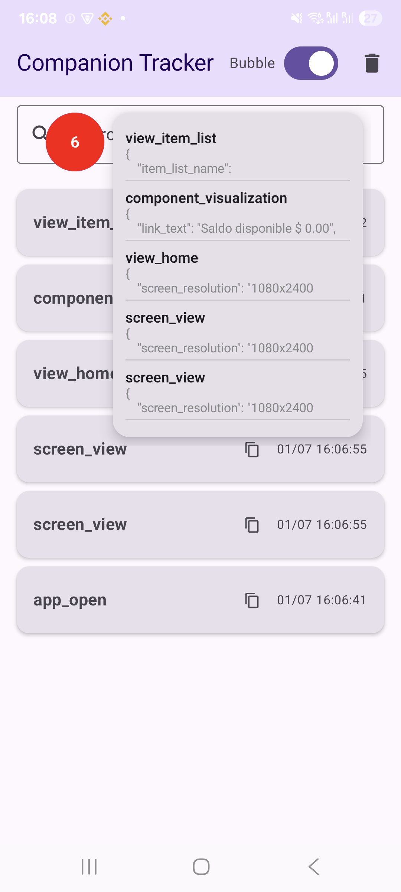

# Companion Tracker





Companion Tracker is an internal QA and automation tool for Android designed to monitor, intercept, and inspect analytics events in real-time. It runs as a background service and displays a floating bubble (overlay) over any application, allowing QA engineers and automated pipelines to see events as they occur without leaving the app they are testing.

## Features
* **Real-time Event Overlay**: A floating bubble using `WindowManager` and Jetpack Compose that stays on top of your app.
* **Persistent Storage**: All received events are stored locally using Room Database, so you don't lose data if the tracker restarts.
* **Search & Filter**: Quickly find specific events by their name or JSON data payload.
* **Copy to Clipboard**: One-click copy buttons for event names and raw data payload to easily paste into bug reports.
* **UIAutomator Support**: All UI components have deterministic `testTags` injected, making it easy to read events from automated testing frameworks.
* **ADB & CI/CD Ready**: Start the service and toggle the bubble programmatically using shell commands.
* **Background Service**: The app listens for implicit broadcasts even when its main UI is closed.

---

##  Integration (How to send events)

To send an analytics event from your main application to the Companion Tracker, simply fire a broadcast `Intent` with the action `com.track.ACTION_ANALYTICS_EVENT` and include the data as string extras.

```kotlin
// Example implementation in your main App:
val intent = Intent("com.track.ACTION_ANALYTICS_EVENT")
intent.putExtra("event_name", "user_login_success")
intent.putExtra("event_data", "{ \"userId\": \"12345\", \"method\": \"google\" }")
context.sendBroadcast(intent)
```

---

##  ADB Commands & Automation

The Companion Tracker is built with automation in mind. You can control its behavior directly from your terminal or CI/CD pipelines via ADB.

### 1. Launch the Application
Start the main UI (which automatically requests permissions and starts the service):
```bash
adb shell am start -n com.test.track/com.test.track.MainActivity
```

### 2. Start the Service (Background Mode)
If the app is closed but permissions have already been granted, you can start the background listener directly:
```bash
adb shell am start-foreground-service -n com.test.track/.receiver.AnalyticsService
```

### 3. Expand the Floating Bubble
To open the events list programmatically (e.g. to inspect it via Maestro):
```bash
adb shell am start-foreground-service -a com.track.ACTION_EXPAND_BUBBLE -n com.test.track/.receiver.AnalyticsService
```

### 4. Collapse the Floating Bubble
To hide the events list programmatically:
```bash
adb shell am start-foreground-service -a com.track.ACTION_COLLAPSE_BUBBLE -n com.test.track/.receiver.AnalyticsService
```

---

The floating bubble and the main list are fully instrumented with Compose `testTags` to allow automation frameworks like **Maestro** to read the event values directly from the UI.

**Available Test Tags:**
* **`analytics_bubble_icon`**: The floating circular icon.
* **`event_item_{id}`**: The root card of a specific event in the list.
* **`event_name_{id}`**: The title/name of the event.
* **`event_data_{id}`**: The detailed JSON string payload (only visible when the card is expanded).

*Note: `{id}` corresponds to the chronological index or database ID of the event.*

---

##  Setup and Build

1. Clone the repository and open it in **Android Studio**.
2. Run a standard Gradle build: `./gradlew build`.
3. Install it on your emulator or physical device.
4. Upon first launch, grant the **Notification** and **Display over other apps** permissions when prompted.
5. You can toggle the floating bubble on/off directly from the switch in the main app's top toolbar.

### Tech Stack
* **Language**: Kotlin
* **UI**: Jetpack Compose
* **Database**: Room Persistence Library (KSP)
* **Architecture**: MVVM with Coroutines & StateFlow
* **System**: Foreground Services & WindowManager (System Alert Window)
